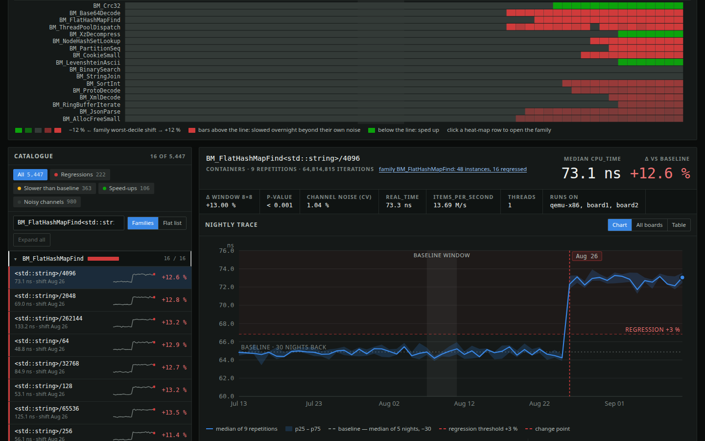

# bench-drift



*The dashboard over 90 days of reports on three boards: the heat map folded to the families that moved, the catalogue filtered to one family, a trace with its change point.*

A dashboard over a history of Google Benchmark reports. `bench-drift` takes
folders of `--benchmark_format=json` reports — every report is one point of
its board's history — and builds a single-page dashboard: a trace for every
benchmark, a heat map by family, a regression detector with `regressed /
improved / stable` verdicts and a noisy-channel flag. Everything is computed in the browser; no server is
needed, and no internet either — the page loads nothing.

## Install

Python 3.11 or newer, nothing else.

```sh
git clone <repo-url> bench-drift
python3 -m venv .venv
.venv/bin/pip install bench-drift/
.venv/bin/bench-drift --version        # bench-drift 0.1.0
```

Or run it straight from the clone, without installing:

```sh
cd bench-drift
./bench-drift --version
```

## Quick start

```sh
# 1. reports — as google/benchmark writes them with repetitions
./your_bench --benchmark_format=json --benchmark_repetitions=5 \
             > runs/qemu/$(date +%F).json

# 2. the dashboard — a file, opens with a double click
bench-drift --board qemu-x86_64=runs/qemu -o dashboard.html

# or on a port, with two boards
bench-drift --board qemu-x86_64=runs/qemu --board board1=runs/b1 --serve
```

No reports of your own yet — generate a corpus and look at that:

```sh
python3 tests/make_sample_runs.py                 # sample-runs/, 3 boards × 90 days
bench-drift --board qemu-x86=sample-runs/qemu-x86 \
            --board board1=sample-runs/board1 \
            --board board2=sample-runs/board2 --serve
```

## How it reads reports

- **A board is named only on the command line**, `--board name=path`,
  repeatable. The path is walked whole, folder nesting does not matter; a glob
  works too. No guessing from subfolders or `host_name`.
- **Each report is a point.** A board's reports are ordered by their own
  `context.date` and every one is a column of that board's history — a re-run
  a few hours after the first launch is a second point, not a replacement.
  Nothing is merged and nothing is read off the folder layout; boards share no
  timeline.
- **A report's day is the day it says**, in its own UTC offset. The display
  window and the baseline offset ("−7 days") are counted in those days; the
  baseline width ("median of 5 reports") and the detector's horizon (the last
  22 reports) are counted in reports.
- **The format is what google/benchmark writes by default** with
  `--benchmark_repetitions=N`: the raw repetition rows followed by mean / median /
  stddev / cv. Median, p25/p75, CV, `iterations` and the counters come from the
  raw rows; with `--benchmark_report_aggregates_only`, from the aggregates. The
  reference for the format is `tests/real_sample.json`.
- The detector needs about 12 reports; on a shorter history everything is
  `stable`.
- **One report is an input too.** The dashboard becomes a snapshot of it:
  times, spread across repetitions, CV and the noisy-channel flag, counters.
  There is nothing to compare against, so Δ and verdicts show a dash, and the
  movement panel says it is waiting for a second report.

## Settings

`bench-drift.toml` in the working directory (or `--config FILE`), all optional;
a command-line argument overrides the file:

```toml
days = 90                # how much history the page gets: calendar days back (0: everything)
                         # from the newest report, whatever ran inside them
metric = "cpu_time"      # or "real_time"
port = 8777              # for --serve
[groups]                 # family → a label shown under the trace title (none by default)
BM_Crc32 = "hashing"
```

There are no boards in the config — paths live only on the command line. The
rest of the flags: `--help`.

## Design

Four decisions, each with the signal that would reverse it, in
[`docs/design.md`](docs/design.md):

- **the detector runs in the browser** over a payload the utility inlines —
  the viewer turns the threshold and the baseline, so the verdict is computed
  where the controls are; `--serve` is a static file on a port;
- **a board is named only on the command line**, never read off a folder
  layout or `host_name`;
- **the utility is Python (stdlib), the page is JavaScript**, and the
  detector exists once — in the page; the source is a local folder, read
  once;
- **a report is the unit of history** — every report is a point, each board
  has its own sequence, the baseline offset is counted in days and its width
  in reports.

The same document has the payload shape and the algorithms: the
change-point detector (an 8×8 window over the last 22 reports, located by the
standardised two-sample statistic, Mann–Whitney for significance, an effect
gate of `max(1.2 %, 1.5·CV)`), the three verdicts and the `noisy` flag, the
baseline as a median of several reports, and why the heat map paints the
family's worst decile.

## Files

| | |
|---|---|
| `bench_drift/` | the package: `__init__.py` (report reader, payload assembly, CLI, `--serve`), `__main__.py`, and `bench-drift.html`, the page — it renders `window.BENCH_DRIFT_DATA` and generates nothing itself |
| `bench-drift` | the launcher for running from the clone |
| `pyproject.toml` | the package metadata; the version lives in `bench_drift.__version__` |
| `tests/` | 91 tests in four files and what they run on: `real_sample.json` — a real report with its numbers altered, the reference for the input format; `make_sample_runs.py` — a generator of a corpus of reports (90 days, one board with a same-day re-run); `reports_from_sample.py` — a history of N reports out of the real one; `run-tests.sh` — the runner, `--quick` skips the browser |
| `docs/screenshot.png` | the picture above |
| `CONTEXT.md` | the glossary: what a report, a board, a baseline, a verdict are |
| `docs/design.md` | how it is built and why: the four design decisions and what would reverse each, the payload, the page's data model, the detector, the baseline, the display window |
| `.github/workflows/bench-drift.yml` | CI: the full test run on Python 3.11 and 3.14, then an install into a venv |
| `CLAUDE.md` | working notes for editing the page and running the checks |

## Tests

```sh
tests/run-tests.sh            # ~20 s, needs node and google-chrome for the page tiers
tests/run-tests.sh --quick    # ~5 s, no browser
```

Each tier runs in its own memory-capped cgroup (when `systemd-run` is
available) — on a small machine that is not superfluous. CI
(`.github/workflows/bench-drift.yml`) runs all of it on Python 3.11 and 3.14
with Node 22, then installs the package into a venv and checks `--version`.
